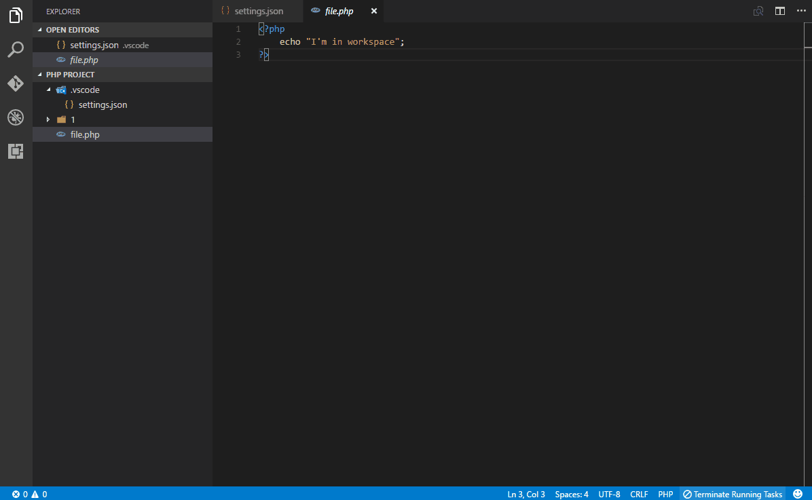
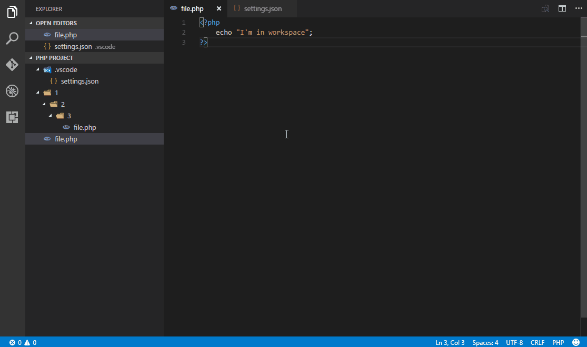
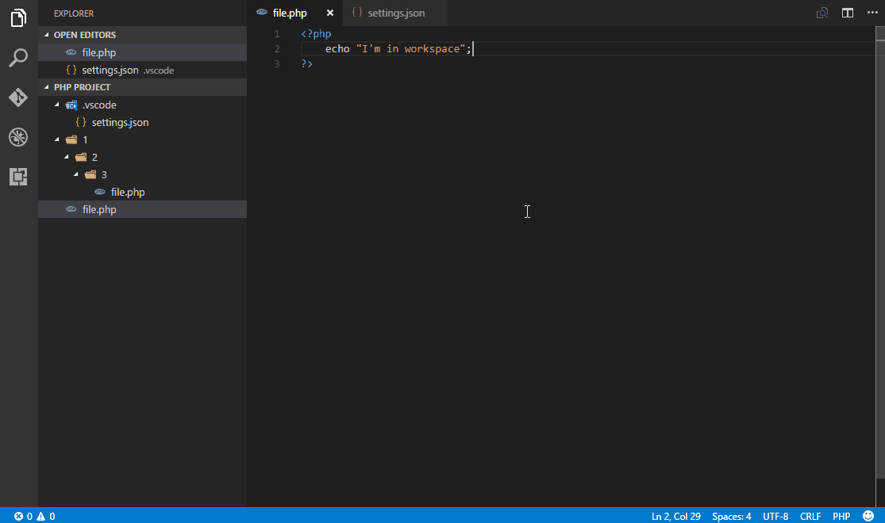

# PHP Project

Sets current workspace or selected directory as a root directory for PHP server.

## Features

* Customizable server settings and paths
* Has right-click menu for starting and stopping server
* Can start PHP server with a directory of an active editor window as a root directory for PHP server
* Server can restart automatically with new root path if PHP server is currently running. No need to stop it ("Yay" for laziness)
* Receive data streams from STDOUT and/or STDERR inside VSCODE output window



* Cosmetic PHP server lauch template. Can be used to make a link to a default server address or something else



* Debug info in case PHP server fails to start



## Requirements

PHP server installed. XAMMP, Wamp or whatever suits you needs and has PHP executable. Path to executable must be set in settings.

## Extension Settings

This extension contributes the following settings:

* `php-project.args`: arguments for PHP server. Can support VSCODE and `${cwd}` variables. Arguments must be of type `string`, otherwise they will be skipped (Default: `["-S", "localhost:3000"]`)
* `php-project.defaultDirectory`: directory to use as root for PHP server. Supports relative paths and VSCODE variables (Default: `${workspaceRoot}`)
* `php-project.executablePath`: path to PHP executable. Supports relative paths and VSCODE variables (Default: `null`)
* `php-project.useNativeExecutablePath`: uses "php.executablePath" or "php.validate.executablePath" as an executable path (Default: `true)`
* `php-project.automaticRestart`: automatically restarts server if current one is still running and user issued command to start a new one (Default: `false`)
* `php-project.launchOutputTemplate`: customize output at PHP server launch. Supports VSCODE, `${cwd}`, `${args}` and `${debug}` variables (Default: "PHP server running with ${cwd} as root directory. Reach server using localhost:3000")

## VSCODE variables (case-sensitive)

* `${workspaceRoot}`: the path of the folder opened in VS Code
* `${workspaceRootFolderName}`: the name of the folder opened in VS Code without any slashes (/)
* `${file}`: the current opened file
* `${relativeFile}`: the current opened file relative to workspaceRoot
* `${fileBasename}`: the current opened file's basename
* `${fileBasenameNoExtension}`: the current opened file's basename without the extension
* `${fileDirname}`: the current opened file's dirname
* `${fileExtname}`: the current opened file's extension

### Extension variables for `"php-project.launchOutputTemplate"` and `"php-project.args"` only

* `${cwd}`: resolved working directory
* `${args}`: resolved arguments (`php-project.launchOutputTemplate` only)
* `${debug}`: outputs all variable values (`php-project.launchOutputTemplate` only)

## Variable replacement and/or path resolution in `"php-project.args"`

It is possible to replace variables and/or to resolve path. It can be enabled by providing specific string (case-sensitive) at the **start** of argument:
* `${R}$`: Replace variables
* `${P}$`: Resolve path
* `${RP}$` or `${PR}$`: Replace variables and then resolve path

You can check/debug the end result by adding `${args}` to `php-project.launchOutputTemplate`. If there is a space after `${...}$`, it is remove, but only **1** space character.

### Example

Given that `${cwd}` is `C:\dir1\dir2\` and `${fileBasename}` is `currentlyOpenFileInEditor.txt`, the follow arguments:

```
[
    "-S",
    "localhost:3000",
    "${cwd}/${fileBasename}",
    "${R}$ ${cwd}/../${fileBasename}",
    "${P}$ ${cwd}/../${fileBasename}",
    "${RP}$ ${cwd}/../${fileBasename}"
]
```

will be resolved like this:

```
[
    "-S",
    "localhost:3000",
    "${cwd}/${fileBasename}",
    "C:\\dir1\\dir2\\../currentlyOpenFileInEditor.txt",
    "${fileBasename}",
    "C:\\dir1\\currentlyOpenFileInEditor.txt"
]
```

## Special thanks to

* FrogTheFrog, the original publisher of this extension
* [brapifra](http://github.com/brapifra), originally inspired/based on his extension.